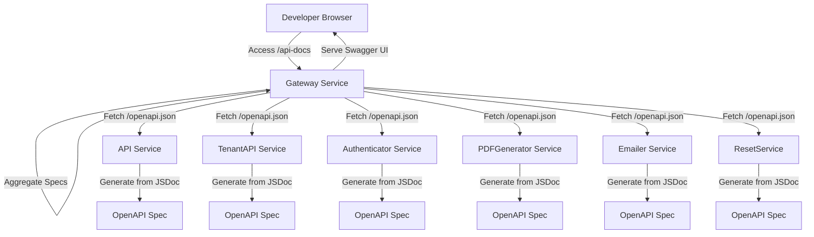

# Design Document

## Overview

This design implements comprehensive OpenAPI 3.0 documentation for all MicroRealEstate backend services, exposed through an interactive Swagger UI interface via the gateway service. The solution uses `swagger-jsdoc` for automatic specification generation from JSDoc comments and `swagger-ui-express` for the interactive documentation interface.

The design follows a distributed approach where each service maintains its own OpenAPI specification, and the gateway aggregates and serves them through a unified interface. This ensures documentation stays close to implementation and scales with the microservices architecture.

## Architecture

### High-Level Architecture



### Component Responsibilities

**Gateway Service:**
- Serves Swagger UI at `/api-docs`
- Aggregates OpenAPI specifications from all services
- Provides unified documentation interface
- Proxies "Try it out" requests to appropriate services
- Controls documentation availability via `ENABLE_API_DOCS` environment variable

**Individual Services (API, TenantAPI, Authenticator, etc.):**
- Generate OpenAPI specifications from JSDoc comments
- Expose specifications at `/openapi.json` endpoint
- Maintain service-specific documentation
- Include authentication requirements and schemas

## Components and Interfaces

### 1. OpenAPI Specification Generator

Each service will use `swagger-jsdoc` to generate OpenAPI 3.0 specifications from JSDoc comments.

**Dependencies:**
- `swagger-jsdoc`: ^6.2.8
- `swagger-ui-express`: ^5.0.0 (gateway only)

**Configuration Structure:**
```javascript
const swaggerDefinition = {
  openapi: '3.0.0',
  info: {
    title: 'Service Name API',
    version: '1.0.0',
    description: 'Service description',
    contact: {
      name: 'MicroRealEstate',
      url: 'https://github.com/microrealestate/microrealestate'
    },
    license: {
      name: 'MIT',
      url: 'https://opensource.org/licenses/MIT'
    }
  },
  servers: [
    {
      url: '/api/v2',
      description: 'API Gateway'
    }
  ],
  components: {
    securitySchemes: {
      bearerAuth: {
        type: 'http',
        scheme: 'bearer',
        bearerFormat: 'JWT'
      }
    }
  }
};
```

### 2. JSDoc Annotation Pattern

**Route Documentation:**
```javascript
/**
 * @openapi
 * /tenants:
 *   get:
 *     summary: Get all tenants
 *     description: Retrieves a list of all tenants for the authenticated organization
 *     tags:
 *       - Tenants
 *     security:
 *       - bearerAuth: []
 *     parameters:
 *       - in: query
 *         name: page
 *         schema:
 *           type: integer
 *           default: 1
 *         description: Page number for pagination
 *       - in: query
 *         name: limit
 *         schema:
 *           type: integer
 *           default: 10
 *         description: Number of items per page
 *     responses:
 *       200:
 *         description: Successful response
 *         content:
 *           application/json:
 *             schema:
 *               type: object
 *               properties:
 *                 tenants:
 *                   type: array
 *                   items:
 *                     $ref: '#/components/schemas/Tenant'
 *                 total:
 *                   type: integer
 *       401:
 *         $ref: '#/components/responses/UnauthorizedError'
 *       500:
 *         $ref: '#/components/responses/InternalServerError'
 */
router.get('/', Middlewares.asyncWrapper(occupantManager.all));
```

**Schema Documentation:**
```javascript
/**
 * @openapi
 * components:
 *   schemas:
 *     Tenant:
 *       type: object
 *       required:
 *         - name
 *         - email
 *       properties:
 *         _id:
 *           type: string
 *           description: Unique identifier
 *         name:
 *           type: string
 *           description: Tenant full name
 *         email:
 *           type: string
 *           format: email
 *           description: Tenant email address
 *         phone:
 *           type: string
 *           description: Tenant phone number
 *         properties:
 *           type: array
 *           items:
 *             $ref: '#/components/schemas/Property'
 *           description: Associated properties
 */
```

**Common Response Documentation:**
```javascript
/**
 * @openapi
 * components:
 *   responses:
 *     UnauthorizedError:
 *       description: Access token is missing or invalid
 *       content:
 *         application/json:
 *           schema:
 *             type: object
 *             properties:
 *               error:
 *                 type: string
 *                 example: Unauthorized
 *     InternalServerError:
 *       description: Internal server error
 *       content:
 *         application/json:
 *           schema:
 *             type: object
 *             properties:
 *               error:
 *                 type: string
 *                 example: Internal server error
 */
```

### 3. Service OpenAPI Endpoint

Each service exposes its specification at `/openapi.json`:

```javascript
// In service index.js/index.ts
import swaggerJsdoc from 'swagger-jsdoc';

const swaggerOptions = {
  definition: swaggerDefinition,
  apis: ['./src/routes.js', './src/**/*.js'] // paths to files with JSDoc
};

const swaggerSpec = swaggerJsdoc(swaggerOptions);

// Expose OpenAPI spec endpoint
app.get('/openapi.json', (req, res) => {
  res.setHeader('Content-Type', 'application/json');
  res.send(swaggerSpec);
});
```

### 4. Gateway Aggregation and Swagger UI

The gateway service aggregates specifications and serves Swagger UI:

```typescript
import swaggerUi from 'swagger-ui-express';
import axios from 'axios';

async function setupSwaggerDocs(application: Express.Application) {
  const config = Service.getInstance().envConfig.getValues();
  
  // Check if API docs should be enabled
  const enableApiDocs = config.ENABLE_API_DOCS !== 'false';
  
  if (!enableApiDocs) {
    logger.info('API documentation is disabled');
    return;
  }

  try {
    // Fetch specifications from all services
    const specs = await Promise.all([
      fetchSpec(config.API_URL, 'API Service'),
      fetchSpec(config.TENANTAPI_URL, 'TenantAPI Service'),
      fetchSpec(config.AUTHENTICATOR_URL, 'Authenticator Service'),
      fetchSpec(config.PDFGENERATOR_URL, 'PDFGenerator Service'),
      fetchSpec(config.EMAILER_URL, 'Emailer Service'),
      ...(config.PRODUCTION ? [] : [fetchSpec(config.RESETSERVICE_URL, 'ResetService')])
    ]);

    // Aggregate specifications
    const aggregatedSpec = aggregateSpecs(specs);

    // Serve Swagger UI
    application.use(
      '/api-docs',
      swaggerUi.serve,
      swaggerUi.setup(aggregatedSpec, {
        explorer: true,
        customSiteTitle: 'MicroRealEstate API Documentation',
        customCss: '.swagger-ui .topbar { display: none }'
      })
    );

    logger.info('API documentation available at /api-docs');
  } catch (error) {
    logger.error('Failed to setup API documentation:', error);
  }
}

async function fetchSpec(serviceUrl: string, serviceName: string) {
  try {
    const response = await axios.get(`${serviceUrl}/openapi.json`);
    return { ...response.data, info: { ...response.data.info, title: serviceName } };
  } catch (error) {
    logger.warn(`Failed to fetch OpenAPI spec from ${serviceName}:`, error);
    return null;
  }
}

function aggregateSpecs(specs: any[]) {
  const validSpecs = specs.filter(spec => spec !== null);
  
  // Create base specification
  const aggregated = {
    openapi: '3.0.0',
    info: {
      title: 'MicroRealEstate API',
      version: '1.0.0',
      description: 'Comprehensive API documentation for all MicroRealEstate services',
      contact: {
        name: 'MicroRealEstate',
        url: 'https://github.com/microrealestate/microrealestate'
      },
      license: {
        name: 'MIT',
        url: 'https://opensource.org/licenses/MIT'
      }
    },
    servers: [
      {
        url: '/',
        description: 'API Gateway'
      }
    ],
    tags: [],
    paths: {},
    components: {
      securitySchemes: {
        bearerAuth: {
          type: 'http',
          scheme: 'bearer',
          bearerFormat: 'JWT',
          description: 'JWT access token obtained from /api/v2/authenticator/signin'
        }
      },
      schemas: {},
      responses: {}
    }
  };

  // Merge all specifications
  validSpecs.forEach(spec => {
    // Merge paths
    Object.assign(aggregated.paths, spec.paths || {});
    
    // Merge schemas
    if (spec.components?.schemas) {
      Object.assign(aggregated.components.schemas, spec.components.schemas);
    }
    
    // Merge responses
    if (spec.components?.responses) {
      Object.assign(aggregated.components.responses, spec.components.responses);
    }
    
    // Merge tags
    if (spec.tags) {
      aggregated.tags.push(...spec.tags);
    }
  });

  return aggregated;
}
```

### 5. Environment Configuration

**Gateway Service (.env):**
```bash
# Enable/disable API documentation
ENABLE_API_DOCS=true  # Set to 'false' in production
```

**Service URLs (already configured):**
- `AUTHENTICATOR_URL`
- `API_URL`
- `TENANTAPI_URL`
- `PDFGENERATOR_URL`
- `EMAILER_URL`
- `RESETSERVICE_URL`

## Data Models

### Core Entity Schemas

The following schemas will be documented across services:

**Tenant (Occupant):**
```yaml
Tenant:
  type: object
  required:
    - name
    - email
  properties:
    _id:
      type: string
    name:
      type: string
    email:
      type: string
      format: email
    phone:
      type: string
    properties:
      type: array
      items:
        $ref: '#/components/schemas/Property'
    leaseId:
      type: string
    beginDate:
      type: string
      format: date
    endDate:
      type: string
      format: date
```

**Property:**
```yaml
Property:
  type: object
  required:
    - name
    - type
  properties:
    _id:
      type: string
    name:
      type: string
    type:
      type: string
      enum: [apartment, house, commercial, parking]
    surface:
      type: number
    price:
      type: number
    expense:
      type: number
```

**Lease:**
```yaml
Lease:
  type: object
  required:
    - name
    - numberOfTerms
    - timeRange
  properties:
    _id:
      type: string
    name:
      type: string
    description:
      type: string
    numberOfTerms:
      type: integer
    timeRange:
      type: string
      enum: [days, weeks, months, years]
    active:
      type: boolean
```

**Rent:**
```yaml
Rent:
  type: object
  properties:
    _id:
      type: string
    term:
      type: integer
    month:
      type: integer
    year:
      type: integer
    totalAmount:
      type: number
    payment:
      type: number
    discount:
      type: number
    status:
      type: string
      enum: [paid, partially-paid, not-paid]
```

**Authentication:**
```yaml
SignInRequest:
  type: object
  required:
    - email
    - password
  properties:
    email:
      type: string
      format: email
    password:
      type: string
      format: password

SignInResponse:
  type: object
  properties:
    accessToken:
      type: string
    refreshToken:
      type: string
    user:
      type: object
      properties:
        email:
          type: string
        firstName:
          type: string
        lastName:
          type: string
```

**Error Response:**
```yaml
ErrorResponse:
  type: object
  properties:
    error:
      type: string
    message:
      type: string
    statusCode:
      type: integer
```

## Co
rrectness Properties

*A property is a characteristic or behavior that should hold true across all valid executions of a system-essentially, a formal statement about what the system should do. Properties serve as the bridge between human-readable specifications and machine-verifiable correctness guarantees.*


### Property 1: Service endpoint aggregation completeness
*For any* backend service (API, TenantAPI, Authenticator, PDFGenerator, Emailer, ResetService), all documented endpoints from that service should appear in the aggregated OpenAPI specification served by the gateway.
**Validates: Requirements 1.2, 1.3, 1.4, 1.5, 4.2**

### Property 2: Authentication requirements documentation
*For any* endpoint that requires authentication, the OpenAPI specification should include the bearerAuth security scheme in its security requirements.
**Validates: Requirements 1.6**

### Property 3: Response status code completeness
*For any* documented endpoint, the OpenAPI specification should include multiple HTTP status codes (at minimum: success code and error codes).
**Validates: Requirements 1.8, 9.1**

### Property 4: JSDoc synchronization
*For any* change to JSDoc annotations in service code, regenerating the OpenAPI specification should reflect those changes in the output.
**Validates: Requirements 3.1**

### Property 5: Schema completeness
*For any* data model schema in the OpenAPI specification, it should include type information, property descriptions, and validation constraints (required fields, formats, etc.).
**Validates: Requirements 6.1, 6.3**

### Property 6: Error response documentation
*For any* endpoint that can return errors, the OpenAPI specification should document error response schemas with status codes, message formats, and descriptions.
**Validates: Requirements 9.1, 9.2, 9.3, 9.4, 9.5**

### Property 7: Semantic version format
*For any* version string in the OpenAPI specification info.version field, it should match semantic versioning format (MAJOR.MINOR.PATCH).
**Validates: Requirements 8.4**

## Error Handling

### Service Unavailability

**Scenario:** Individual service is down or unreachable when gateway attempts to fetch OpenAPI spec.

**Handling:**
- Gateway logs warning but continues aggregation with available services
- Partial documentation is served rather than complete failure
- Health check endpoint reports service status separately

**Implementation:**
```typescript
async function fetchSpec(serviceUrl: string, serviceName: string) {
  try {
    const response = await axios.get(`${serviceUrl}/openapi.json`, {
      timeout: 5000
    });
    return { ...response.data, info: { ...response.data.info, title: serviceName } };
  } catch (error) {
    logger.warn(`Failed to fetch OpenAPI spec from ${serviceName}:`, error.message);
    return null; // Continue with other services
  }
}
```

### Invalid OpenAPI Specification

**Scenario:** Service returns malformed or invalid OpenAPI JSON.

**Handling:**
- Validate spec structure before aggregation
- Log error with service name
- Skip invalid spec and continue with valid ones

**Implementation:**
```typescript
function validateSpec(spec: any, serviceName: string): boolean {
  if (!spec || typeof spec !== 'object') {
    logger.error(`Invalid spec from ${serviceName}: not an object`);
    return false;
  }
  if (!spec.openapi || !spec.info || !spec.paths) {
    logger.error(`Invalid spec from ${serviceName}: missing required fields`);
    return false;
  }
  return true;
}
```

### Documentation Disabled

**Scenario:** `ENABLE_API_DOCS` is set to 'false'.

**Handling:**
- Return 404 for `/api-docs` endpoint
- Do not initialize Swagger UI middleware
- Log that documentation is disabled

**Implementation:**
```typescript
application.use('/api-docs', (req, res) => {
  if (config.ENABLE_API_DOCS === 'false') {
    res.status(404).send('API documentation is disabled');
    return;
  }
  // Serve Swagger UI
});
```

### Missing JSDoc Annotations

**Scenario:** Endpoint exists but lacks JSDoc documentation.

**Handling:**
- Endpoint will not appear in OpenAPI spec (by design)
- Developers must add JSDoc comments to document endpoints
- Linting rules can enforce JSDoc presence (future enhancement)

### Conflicting Path Definitions

**Scenario:** Multiple services define the same path (unlikely but possible).

**Handling:**
- Last service wins during aggregation (Object.assign behavior)
- Log warning about path conflict
- Consider namespacing paths by service in future

## Testing Strategy

### Unit Testing

**Test Coverage:**
1. **Spec Generation Tests** - Verify swagger-jsdoc generates valid OpenAPI specs from JSDoc
2. **Aggregation Logic Tests** - Test merging multiple specs into one
3. **Validation Tests** - Test spec validation logic
4. **Environment Variable Tests** - Test ENABLE_API_DOCS behavior

**Example Unit Test:**
```javascript
describe('OpenAPI Spec Generation', () => {
  it('should generate valid OpenAPI spec from JSDoc comments', () => {
    const spec = generateSpec();
    expect(spec).toHaveProperty('openapi', '3.0.0');
    expect(spec).toHaveProperty('info');
    expect(spec).toHaveProperty('paths');
  });

  it('should include security schemes for authenticated endpoints', () => {
    const spec = generateSpec();
    expect(spec.components.securitySchemes).toHaveProperty('bearerAuth');
  });
});

describe('Spec Aggregation', () => {
  it('should merge paths from multiple services', () => {
    const spec1 = { paths: { '/api/v2/tenants': {} } };
    const spec2 = { paths: { '/tenantapi/info': {} } };
    const aggregated = aggregateSpecs([spec1, spec2]);
    expect(Object.keys(aggregated.paths)).toHaveLength(2);
  });

  it('should handle null specs gracefully', () => {
    const spec1 = { paths: { '/api/v2/tenants': {} } };
    const aggregated = aggregateSpecs([spec1, null]);
    expect(Object.keys(aggregated.paths)).toHaveLength(1);
  });
});
```

### Property-Based Testing

Property-based tests will use **fast-check** library for JavaScript/TypeScript to verify universal properties across many generated inputs.

**Property Test 1: Service endpoint aggregation completeness**
```javascript
import fc from 'fast-check';

describe('Property: Service endpoint aggregation completeness', () => {
  it('should include all service endpoints in aggregated spec', () => {
    fc.assert(
      fc.property(
        fc.array(arbOpenAPISpec(), { minLength: 1, maxLength: 6 }),
        (serviceSpecs) => {
          const aggregated = aggregateSpecs(serviceSpecs);
          
          // For each service spec
          serviceSpecs.forEach(spec => {
            if (spec && spec.paths) {
              // All paths from service should be in aggregated spec
              Object.keys(spec.paths).forEach(path => {
                expect(aggregated.paths).toHaveProperty(path);
              });
            }
          });
        }
      ),
      { numRuns: 100 }
    );
  });
});

// Arbitrary generator for OpenAPI specs
function arbOpenAPISpec() {
  return fc.record({
    openapi: fc.constant('3.0.0'),
    info: fc.record({
      title: fc.string(),
      version: fc.string()
    }),
    paths: fc.dictionary(
      fc.string().map(s => `/${s}`), // path keys
      fc.record({
        get: fc.record({
          summary: fc.string(),
          responses: fc.dictionary(fc.string(), fc.object())
        })
      })
    )
  });
}
```

**Property Test 2: Authentication requirements documentation**
```javascript
describe('Property: Authentication requirements documentation', () => {
  it('should include bearerAuth for protected endpoints', () => {
    fc.assert(
      fc.property(
        arbOpenAPISpecWithAuth(),
        (spec) => {
          Object.values(spec.paths).forEach(pathItem => {
            Object.values(pathItem).forEach(operation => {
              if (operation.requiresAuth) {
                expect(operation.security).toContainEqual({ bearerAuth: [] });
              }
            });
          });
        }
      ),
      { numRuns: 100 }
    );
  });
});
```

**Property Test 3: Response status code completeness**
```javascript
describe('Property: Response status code completeness', () => {
  it('should document multiple status codes for each endpoint', () => {
    fc.assert(
      fc.property(
        arbOpenAPISpec(),
        (spec) => {
          Object.values(spec.paths).forEach(pathItem => {
            Object.values(pathItem).forEach(operation => {
              const statusCodes = Object.keys(operation.responses || {});
              // Should have at least success and error codes
              expect(statusCodes.length).toBeGreaterThanOrEqual(2);
            });
          });
        }
      ),
      { numRuns: 100 }
    );
  });
});
```

**Property Test 4: JSDoc synchronization**
```javascript
describe('Property: JSDoc synchronization', () => {
  it('should reflect JSDoc changes in generated spec', () => {
    fc.assert(
      fc.property(
        fc.record({
          path: fc.string(),
          method: fc.constantFrom('get', 'post', 'put', 'delete'),
          summary: fc.string(),
          description: fc.string()
        }),
        (jsdocData) => {
          // Create JSDoc comment
          const jsdoc = createJSDoc(jsdocData);
          
          // Generate spec from JSDoc
          const spec = generateSpecFromJSDoc(jsdoc);
          
          // Verify changes are reflected
          const operation = spec.paths[jsdocData.path]?.[jsdocData.method];
          expect(operation?.summary).toBe(jsdocData.summary);
          expect(operation?.description).toBe(jsdocData.description);
        }
      ),
      { numRuns: 100 }
    );
  });
});
```

**Property Test 5: Schema completeness**
```javascript
describe('Property: Schema completeness', () => {
  it('should include type, description, and constraints for all schema properties', () => {
    fc.assert(
      fc.property(
        arbOpenAPISpec(),
        (spec) => {
          if (spec.components?.schemas) {
            Object.values(spec.components.schemas).forEach(schema => {
              if (schema.properties) {
                Object.values(schema.properties).forEach(prop => {
                  // Each property should have type
                  expect(prop).toHaveProperty('type');
                  // Should have description or be a $ref
                  expect(
                    prop.description || prop.$ref
                  ).toBeDefined();
                });
              }
            });
          }
        }
      ),
      { numRuns: 100 }
    );
  });
});
```

**Property Test 6: Error response documentation**
```javascript
describe('Property: Error response documentation', () => {
  it('should document error responses with schemas', () => {
    fc.assert(
      fc.property(
        arbOpenAPISpec(),
        (spec) => {
          Object.values(spec.paths).forEach(pathItem => {
            Object.values(pathItem).forEach(operation => {
              const responses = operation.responses || {};
              const errorCodes = Object.keys(responses).filter(
                code => parseInt(code) >= 400
              );
              
              // Each error response should have schema
              errorCodes.forEach(code => {
                const response = responses[code];
                expect(
                  response.content?.['application/json']?.schema ||
                  response.$ref
                ).toBeDefined();
              });
            });
          });
        }
      ),
      { numRuns: 100 }
    );
  });
});
```

**Property Test 7: Semantic version format**
```javascript
describe('Property: Semantic version format', () => {
  it('should match semver format for version strings', () => {
    fc.assert(
      fc.property(
        arbOpenAPISpec(),
        (spec) => {
          const version = spec.info.version;
          const semverRegex = /^\d+\.\d+\.\d+(-[a-zA-Z0-9.-]+)?(\+[a-zA-Z0-9.-]+)?$/;
          expect(version).toMatch(semverRegex);
        }
      ),
      { numRuns: 100 }
    );
  });
});
```

### Integration Testing

**Test Scenarios:**
1. **End-to-End Documentation Access** - Start all services, access `/api-docs`, verify Swagger UI loads
2. **Try It Out Functionality** - Use Swagger UI to make authenticated request, verify it reaches backend
3. **Service Failure Handling** - Stop one service, verify documentation still loads with remaining services
4. **Environment Variable Control** - Test enabling/disabling documentation via ENABLE_API_DOCS

**Example Integration Test:**
```javascript
describe('API Documentation Integration', () => {
  it('should serve Swagger UI at /api-docs', async () => {
    const response = await request(gatewayApp).get('/api-docs');
    expect(response.status).toBe(200);
    expect(response.text).toContain('swagger-ui');
  });

  it('should aggregate specs from all services', async () => {
    const response = await request(gatewayApp).get('/api-docs');
    const html = response.text;
    
    // Verify it includes endpoints from different services
    expect(html).toContain('/api/v2/tenants');
    expect(html).toContain('/tenantapi/');
    expect(html).toContain('/api/v2/authenticator/signin');
  });

  it('should return 404 when documentation is disabled', async () => {
    process.env.ENABLE_API_DOCS = 'false';
    const response = await request(gatewayApp).get('/api-docs');
    expect(response.status).toBe(404);
  });
});
```

## Implementation Notes

### Service Implementation Order

1. **Phase 1: Gateway Foundation**
   - Add swagger-ui-express to gateway
   - Implement aggregation logic
   - Add environment variable control
   - Create basic Swagger UI endpoint

2. **Phase 2: Service Documentation**
   - Add swagger-jsdoc to each service
   - Document Authenticator endpoints (login, refresh, logout)
   - Document API service endpoints (tenants, properties, leases, rents)
   - Document TenantAPI endpoints
   - Document PDFGenerator endpoints
   - Document Emailer endpoints
   - Document ResetService endpoints (dev/CI only)

3. **Phase 3: Schema Documentation**
   - Document core data models (Tenant, Property, Lease, Rent)
   - Document authentication models (SignIn, Token)
   - Document error response models
   - Add common response definitions

4. **Phase 4: Testing and Refinement**
   - Write unit tests for aggregation
   - Write property-based tests
   - Write integration tests
   - Refine documentation based on testing

### JSDoc Best Practices

1. **Keep annotations close to code** - Document routes in route files
2. **Use $ref for reusability** - Reference common schemas and responses
3. **Include examples** - Add example values for better documentation
4. **Document all parameters** - Include query params, path params, body
5. **Document all responses** - Include success and error cases
6. **Use tags for organization** - Group related endpoints

### Performance Considerations

1. **Spec Caching** - Cache aggregated spec for 5 minutes to reduce service calls
2. **Lazy Loading** - Only fetch specs when /api-docs is accessed
3. **Timeout Handling** - Set reasonable timeouts (5s) for spec fetching
4. **Parallel Fetching** - Use Promise.all to fetch specs concurrently

### Security Considerations

1. **Production Disable** - Default to disabled in production
2. **No Sensitive Data** - Ensure examples don't contain real credentials
3. **Rate Limiting** - Consider rate limiting /api-docs endpoint
4. **CORS** - Swagger UI respects existing CORS configuration

## Future Enhancements

1. **Spec Versioning** - Support multiple API versions with version selector
2. **Custom Themes** - Brand Swagger UI with MicroRealEstate styling
3. **Export Functionality** - Allow downloading OpenAPI specs as JSON/YAML
4. **Postman Collection** - Generate Postman collections from OpenAPI specs
5. **API Changelog** - Track and display API changes between versions
6. **Mock Server** - Generate mock responses from OpenAPI specs for testing
7. **Client SDK Generation** - Auto-generate client libraries from specs
