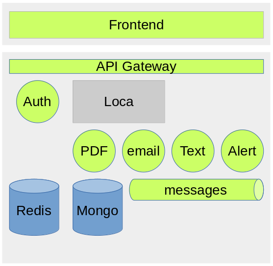

# Microrealestate

Microrealestate is a set of microservices which work together to offer an open source application for property management.

This application draws its fundamentals from the monolithic application: [Loca](https://github.com/camelaissani/loca)



| µService                                                              | Description                                                                                                      | Status          |
| :-------------------------------------------------------------------- | :--------------------------------------------------------------------------------------------------------------- | :-------------: |
| [Gateway](./config/nginx/etc/conf.d)                                  | Routes HTTP requests to the services (NGINX)                                                                     | Available       |
| [Frontend](https://github.com/microrealestate/frontend)               | The web application                                                                                              | Dev in progress |
| [Authenticator](https://github.com/microrealestate/authenticator)     | Handles login/logout and tokens management                                                                       | Available       |
| [EMailer](https://github.com/microrealestate/emailer)                 | Generates and sends emails with [mailgun](https://www.mailgun.com/)                                              | Available       |
| [API](https://github.com/microrealestate/api)                         | Exposes UI API and core engine                                                                                   | Available       |
| [PDFGenerator](https://github.com/microrealestate/pdfgenerator)       | Generates PDF documents (letters, contracts, invoices...)                                                        | Available       |
| Messages                                                              | message broker                                                                                                   | Not available   |
| Alert                                                                 | Sends alert messages based on business rules (contract deadlines, unpaid rents...)                               | Not available   |
| Text                                                                  | Generates and texts (cash balance, alerts...)                                                                    | Not available   |


## Debugging the application

### Prerequisite
- Docker and docker-compose installed
> The `mre` bash script is uses for building, running the application. If running on Windows use `mre.ps1`.


You would need to have the latest version of [VS Code](https://code.visualstudio.com/) installed.

Then bring up the Debug view, click on the Debug icon in the **Activity Bar** on the side of VS Code. You can also use the keyboard shortcut `Ctrl+Shift+D`.


### Clone the GitHub repository
```shell
$ git clone --recursive https://github.com/microrealestate/microrealestate.git
```

### Go to the microrealestate
```shell
$ cd microrealestate
```

### Launch the application in development mode:

```shell
$ ./mre dev
```

Next, go to the debug bar:


Then select one of these values to attach the VS Code debugger to the application:

- `Docker: Attach to API` (Exposes the UI API and core engine)
- `Docker: Attach to Authenticator` (Handles the authentication)
- `Docker: Attach to Emailer` (Sends emails)
- `Docker: Attach to PdfGenerator` (Generates PDF documents)

For more information about VS Code debugging go [here](https://code.visualstudio.com/Docs/editor/debugging#_debug-actions)
