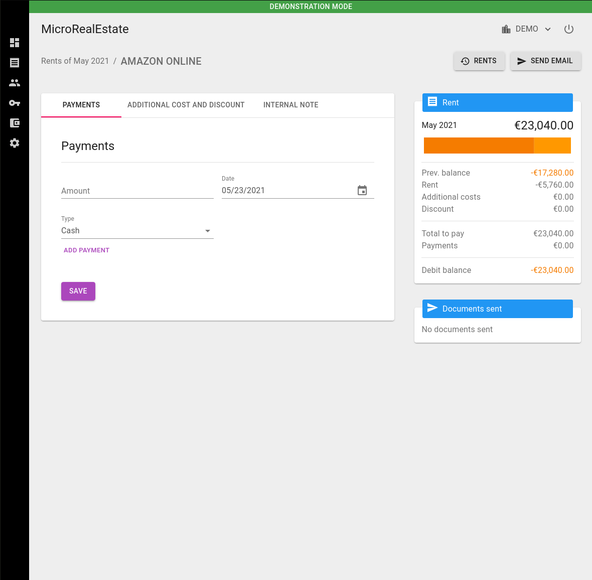
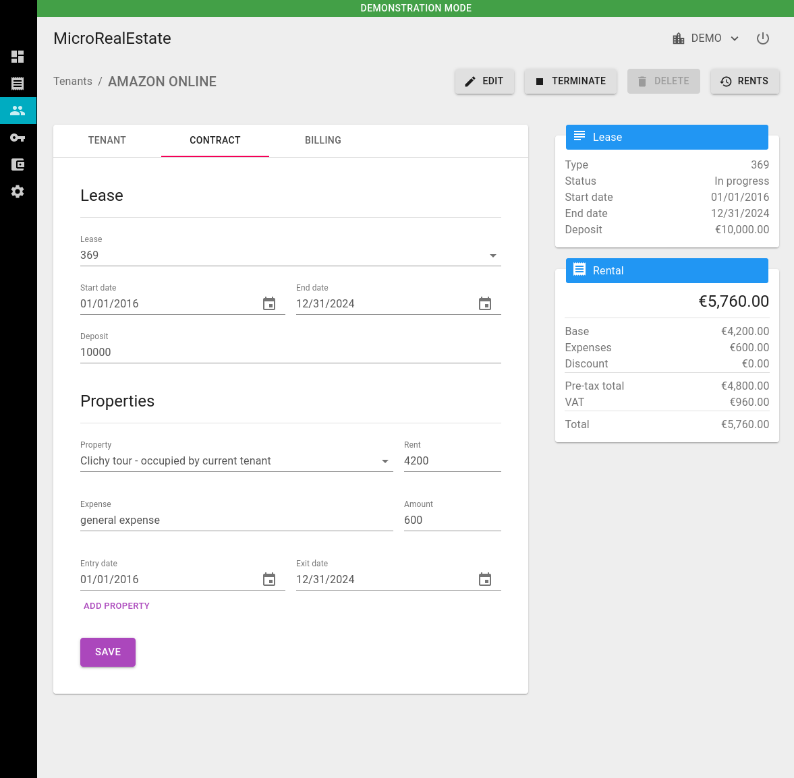
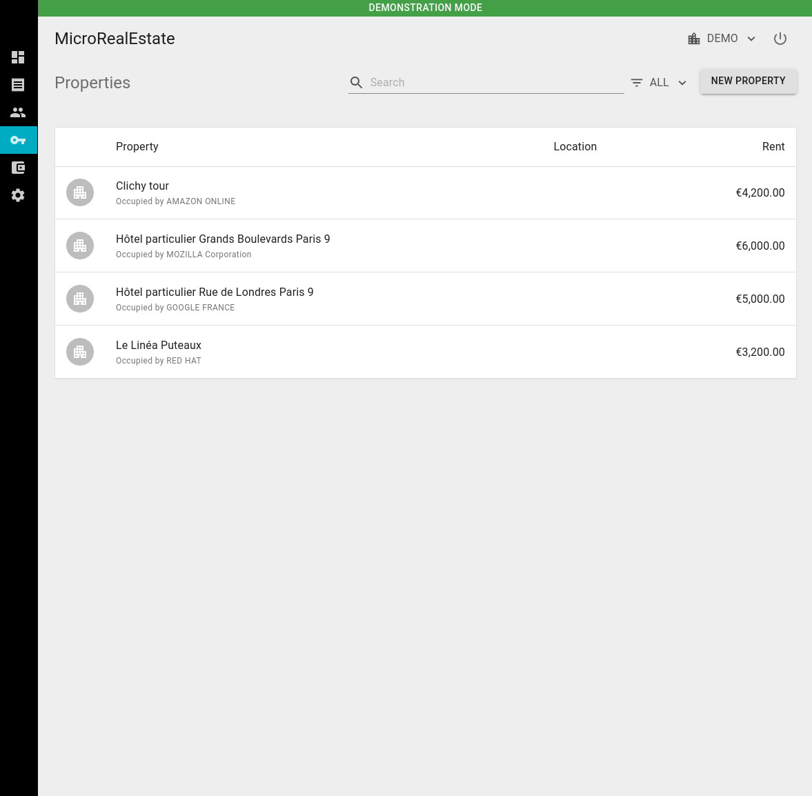
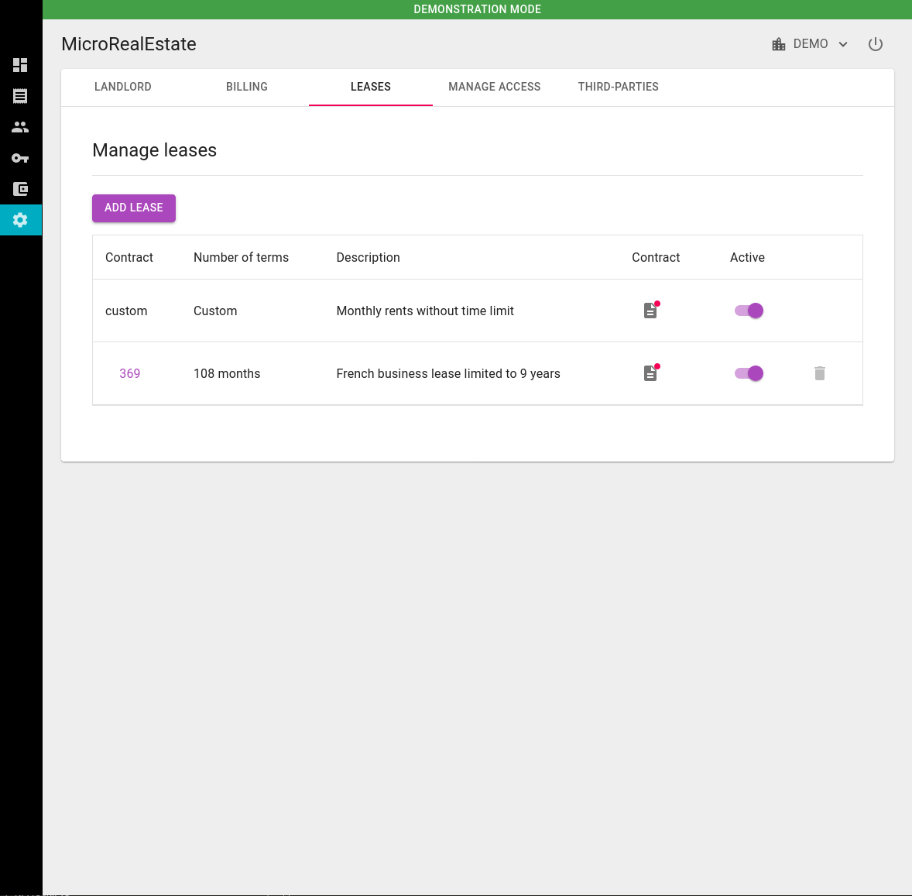
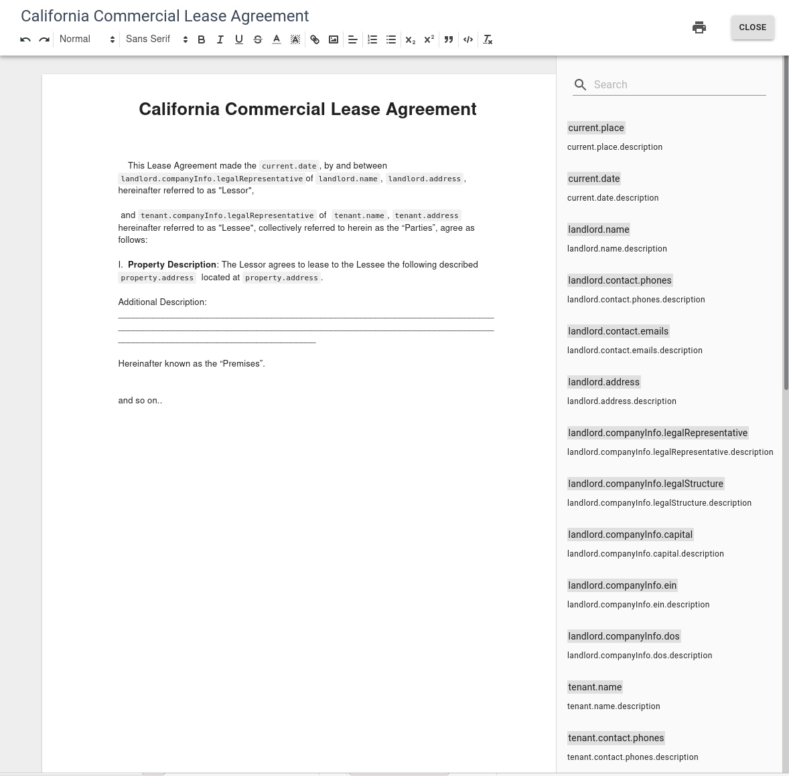

[](https://gitter.im/microrealestate)

# Microrealestate

The application which helps the landlords to manage their property rents.

## Features

The main functionalities are:

- Store information of the properties and the tenants in one place
- Create rent leases from templates
- Follow the rent payments and manage the rent overdues
- Create custom documents to communicate with tenants
- Manage the real estate business with several collaborators and in different organizations

## Screenshots

|                           |                                 |                        |
|:-------------------------:|:-------------------------------:|:----------------------:|
| **Rents page**                | **Send notices, receipt by email**  | **Pay a rent**             |
| [](./picture/rents.png) | [](./picture/sendmassemails.png) | [](./picture/payment.png) |
| **Tenants page**              | **Tenant details**                 | |
| [](./picture/tenants.png) | [](./picture/tenantcontract.png) | |
| **Properties page**           | **Property details**               | |
| [](./picture/properties.png) | [](./picture/property.png)| |
| **Landlord page**             | **Template leases**                | **Author a contract**          |
| [](./picture/landlord.png) | [](./picture/leases.png) | [](./picture/contracttemplate.png) |
| **Members**                        | |
| [](./picture/members.png) | |

## Getting started

### Prerequisite
- Docker and docker-compose installed

> The `mre` bash script is uses for building, running the application. If running on Windows use `mre.exe` on Mac `mre-macos`.

### Clone the GitHub repository
```shell
$ git clone --recursive https://github.com/microrealestate/microrealestate.git
```

### Go to the microrealestate
```shell
$ cd microrealestate
```

### Build the application
```shell
$ ./mre build
```

### Start the application
```shell
$ ./mre start
```

Once the application is ready, the message bellow is displayed:

```shell
Front-end                 http://localhost:8080/app
```

### Run the user interface

Take your favorite internet navigator and go to this link: http://localhost:8080/app

## Community

* Contribute on [Issues](https://github.com/microrealestate/microrealestate/issues)
* [Run and debug the application](./DEVELOPER.md)

## Contact

* LinkedIn: [www.linkedin.com/in/caissani](https://www.linkedin.com/in/caissani/)
* twitter: [@camelaissani](https://twitter.com/camelaissani)
* website: https://www.nuageprive.fr/

## License

MIT License
