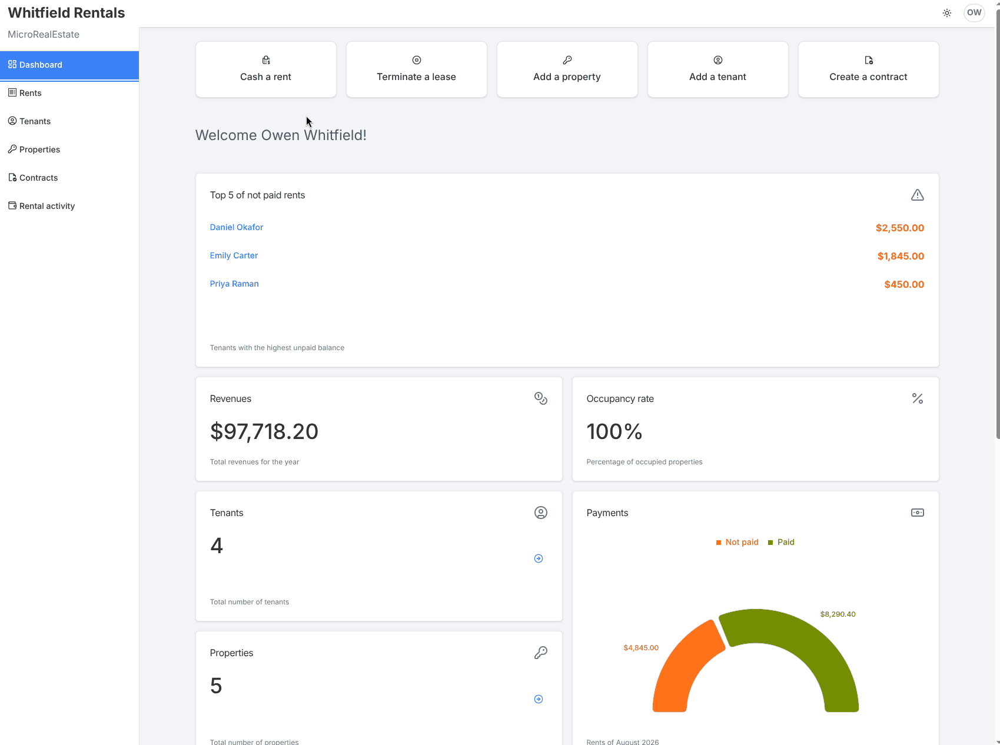

<div align="center">
  <h1>MicroRealEstate</h1>
  <p><strong>Leases, rents and receipts in one app. Self-hosted on a machine you own.</strong></p>
  <p>
    <a href="https://microrealestate.app">Website</a> |
    <a href="./documentation/DEVELOPER.md">Developers</a> |
    <a href="./LICENSE.md">License</a> |
    <a href="https://ko-fi.com/camelaissani/tip">Donate</a>
  </p>
  <p>
    <a href="https://ko-fi.com/camelaissani/tip"></a>
    <a href="https://github.com/sponsors/camelaissani"></a>
  </p>
  <p>
    <a href="https://github.com/microrealestate/microrealestate/actions/workflows/ci.yml"></a>
    <a href="./LICENSE.md"></a>
  </p>
</div>

<a href="./documentation/pictures/dashboard.png"></a>

MicroRealEstate is a self-hosted property management application for landlords. Record a payment and the balance updates itself, generate a lease from your own template, email this month's receipts in one pass.

All of it on a machine you own, not in somebody else's cloud.

See the app screen by screen on [microrealestate.app](https://microrealestate.app).

## ✨ Features

- **Rents**: record payments as they land, balances recalculate themselves, and overdue rents stay visible.
- **Leases**: generate leases from your own customizable templates instead of copying last year's file.
- **Documents**: generate rent notices and receipts, then email them to the right tenants in one pass.
- **Tenants and properties**: every unit, tenant and contact record in one place.
- **Collaboration**: invite a second person from Settings > Access; their own account, the same records.
- **Tenant portal**: tenants check their lease, payment history and receipts themselves.
- **Self-hosted**: Docker microservices and MongoDB on any Linux machine; your data never leaves your server.

## 🚀 Getting Started

Run the installer on any Linux machine - your laptop, an old desktop, or the cheapest VPS your host sells. Docker and Compose are installed automatically if missing. Binding the default ports (80/443) needs root, so the installer will prompt for your sudo password.

```shell
curl -sSL https://raw.githubusercontent.com/microrealestate/microrealestate/main/install.sh | bash
```

The installer will:

1. Detect the server's IP address automatically
2. Generate required secrets
3. Start all services
4. Display URLs for landlord and tenant UIs

Then, on first run:

1. Navigate to the landlord UI shown in the banner
2. Create your account
3. Add your first property and tenant
4. Configure a domain from Settings > Web server to serve the app over HTTPS

To update an existing installation, run the same one-liner from the install directory
(the one holding `.env`) with `update` appended:

```shell
curl -sSL https://raw.githubusercontent.com/microrealestate/microrealestate/main/install.sh | bash -s -- update
```

(`./install.sh update` works too, if you did keep a local copy.)

`install.sh` also drops an `mre.sh` script next to it for day-to-day operations (start, stop, restart,
status, logs, backup, restore) - see [documentation/OPERATIONS.md](./documentation/OPERATIONS.md).

How releases are cut and images are promoted is covered in [documentation/RELEASING.md](./documentation/RELEASING.md).

## 🛠️ Developers

To run the application in development mode, follow the steps outlined in the [developer documentation](./documentation/DEVELOPER.md).

## 🤝 Contributing

Check out the [contributing guide](./CONTRIBUTING.md) before opening a pull request.

## ❤️ Support

MicroRealEstate is built and maintained by Camel Aissani, with help from the community on GitHub. There is no company behind it, and nothing here is trying to sell you anything. Donations are the only thing funding the work - if MicroRealEstate is useful to you, a one-off contribution keeps it alive 🙏

[](https://ko-fi.com/camelaissani/tip)
[](https://github.com/sponsors/camelaissani)

## 📄 License

MicroRealEstate is **source available** under the Sustainable Use License (SUL) v2.0.

- Free for a private landlord managing up to **5 rental units**, outside any professional, business or revenue-generating activity.
- You may modify the source and share it free of charge for non-commercial use.
- Commercial use is not permitted under the SUL. That includes hosted or SaaS provision, paid redistribution, managing more than 5 rental units, and any use for the benefit of third parties. It requires a separate commercial license from the licensor.
- Commits up to `479d0ad7` (December 9, 2025) remain under the MIT License; commits from `a95d44d` (February 11, 2026) onward are under the SUL.

Read the full terms in [LICENSE.md](./LICENSE.md).

## Contact

Commercial licensing: [camel.aissani@gmail.com](mailto:camel.aissani@gmail.com?subject=MicroRealEstate%20commercial%20use)

LinkedIn: [www.linkedin.com/in/caissani](https://www.linkedin.com/in/caissani/)
