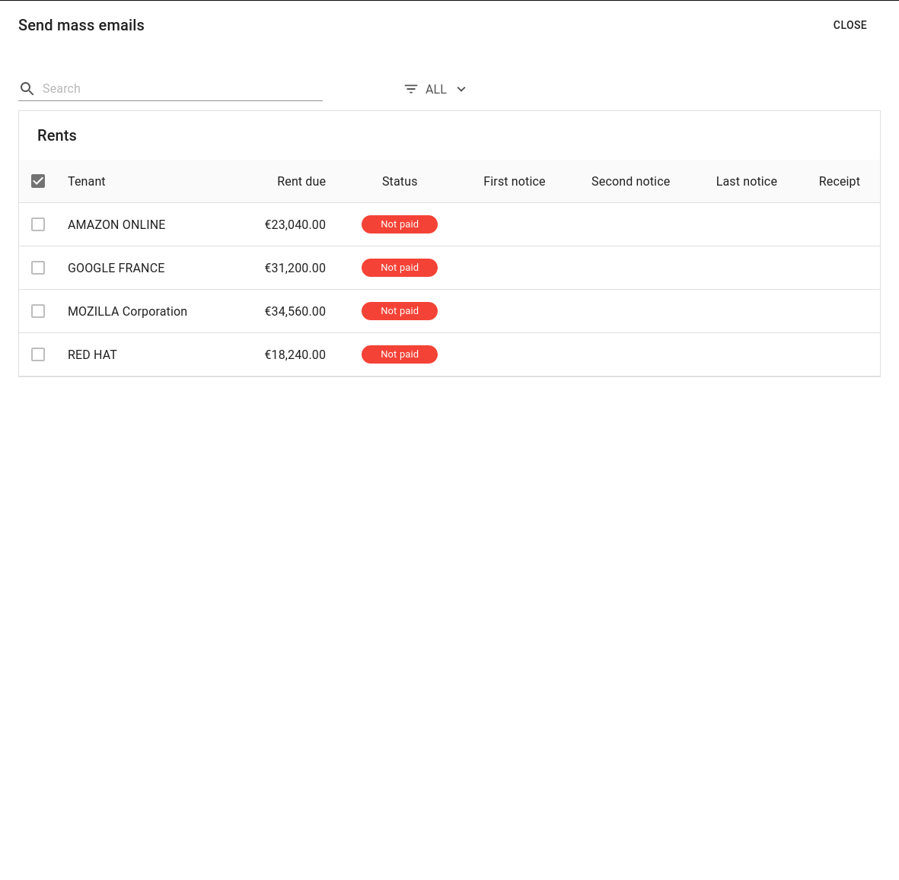
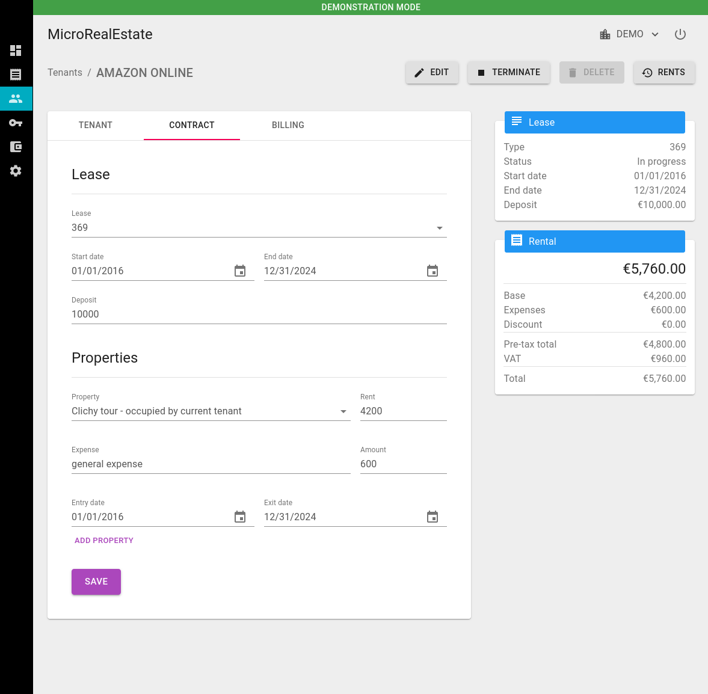

# MicroRealEstate

[](https://github.com/microrealestate/microrealestate/actions/workflows/ci.yml)

MicroRealEstate is an open-source application designed to assist landlords in managing their properties and rentals. MicroRealEstate (MRE) serves as a centralized platform for landlords to streamline their property management tasks.

## Key Features

- Centralized Property and Tenant Information: MRE allows landlords to store all property and tenant details in one convenient location. From property specifications to tenant records and contact information.

- Rent Lease Creation: MRE simplifies the process of creating rent leases. It offers customizable templates that enable landlords to generate lease.

- Rent Payment Tracking: MRE provides a comprehensive system for tracking rent payments, helping landlords stay updated on transactions and promptly address any overdue payments.

- Custom Document Generation: MRE allows landlords to create custom documents for effective communication with tenants. Personalized letters, notices, and announcements can be generated to ensure clear and consistent correspondence.

- Collaboration: Whether you are an independent landlord or manage a real estate business with multiple collaborators, MRE supports collaboration and facilitates task coordination within teams.

- **Utility Bill Management**: Track water, gas, and electric bills per property. Bills are split automatically across tenants based on configured allocations. Each bill shows a full before/after split breakdown, supports attaching the PDF bill alongside the email confirmation, and tracks QuickBooks posting status.

- **Multi-Attachment Utility Bills**: Each utility bill entry holds multiple files — the PDF bill and the original email confirmation text — stored side by side. Files are organized on disk by account number and billing month for easy auditing.

- **Utility Invoice Generation**: Generate and email utility invoices to tenants directly from a bill entry, with invoice locking to prevent changes after invoicing.

## Screenshots

|                                                                                                                           |                                                                                                                                   |                                                                                                                                       |
| :-----------------------------------------------------------------------------------------------------------------------: | :-------------------------------------------------------------------------------------------------------------------------------: | :-----------------------------------------------------------------------------------------------------------------------------------: |
|                                                      **Rents page**                                                       |                                                **Send notices, receipt by email**                                                 |                                                            **Pay a rent**                                                             |
|      [](./documentation/pictures/rents.png)      | [](./documentation/pictures/sendmassemails.png) |          [](./documentation/pictures/payment.png)          |
|                                                     **Tenants page**                                                      |                                                        **Tenant details**                                                         |                                                                                                                                       |
|    [](./documentation/pictures/tenants.png)    | [](./documentation/pictures/tenantcontract.png) |                                                                                                                                       |
|                                                    **Properties page**                                                    |                                                       **Property details**                                                        |                                                                                                                                       |
| [](./documentation/pictures/properties.png) |       [](./documentation/pictures/property.png)       |                                                                                                                                       |
|                                                     **Landlord page**                                                     |                                                        **Template leases**                                                        |                                                         **Author a contract**                                                         |
|   [](./documentation/pictures/landlord.png)   |         [](./documentation/pictures/leases.png)         | [](./documentation/pictures/contracttemplate.png) |
|                                                        **Members**                                                        |                                                                                                                                   |
|    [](./documentation/pictures/members.png)    |                                                                                                                                   |

## Self-host the application

> **Prerequisite**
>
> - [Install Docker and Compose](https://docs.docker.com/compose/install)

### Download the docker-compose.yml file

``` shell
mkdir mre
cd mre
curl https://raw.githubusercontent.com/microrealestate/microrealestate/master/docker-compose.yml > docker-compose.yml
curl https://raw.githubusercontent.com/microrealestate/microrealestate/master/.env.domain > .env
```

Update the secrets and tokens in the `.env` file (at the end of the file).

**🚨 IMPORTANT**

In case you previously ran the application, the secrets, the tokens and the MONGO_URL must be reported from previous .env file to the new one.
Otherwise, the application will not point to the correct database and will not be able to login with the previous credentials.

### Localhost setup

Start the application under localhost:

``` shell
APP_PORT=8080 docker compose --profile local up
```
The application will be available on http://localhost:8080/landlord and http://localhost:8080/tenant.


### Ip setup

Start the application under a custom ip:

``` shell
sudo APP_DOMAIN=x.x.x.x docker compose up
```
x.x.x.x is the ip address of the server.

The application will be available on http://x.x.x.x/landlord and http://x.x.x.x/tenant.

In case you need to use a port number do not pass it in the APP_DOMAIN. You can use the APP_PORT environment variable.


### Domain with https setup

Start the app under a custom domain over https:

``` shell
sudo APP_DOMAIN=app.example.com APP_PROTOCOL=https docker compose up
```

Make sure your DNS records are pointing to the private server. The application will automatically issue the ssl certificate.

The application will be available on https://app.example.com/landlord and https://app.example.com/tenant.


### Backup and restore the data

Uploaded files (lease documents, utility bills, attachments) are stored on the path configured by `UPLOADS_DIRECTORY`.
For the host setup in this branch, mount `/srv/file-storage` on the Docker host
and set `UPLOADS_DIRECTORY=/srv/file-storage` for both the API and PDFGenerator containers.

Utility bill PDFs are stored under `attachments/utility_bills/{account-number}/{YYYY-MM}/` so they can be located and audited by account and month.

The backup and restore commands can be executed when the application is running to allow connecting to MongoDB.

#### Backup

In the mre directory run:

``` shell
docker exec <mongo-container> mongodump --uri=mongodb://localhost/mre --gzip --archive > backup/mre-$(date +%F_%H-%M-%S).dump
```

The database name for this fork is `mre` (not `mredb`). The archive file will be placed in the `backup/` folder.

#### Restore

In the mre/backup directory, select an archive file you want to restore.

Then run the restore command:

``` shell
docker exec <mongo-container> mongorestore --uri=mongodb://localhost/mre --drop --gzip --archive < backup/mre-XXXX.dump
```

Where `mre-XXXX.dump` is the archive file you selected.

### Utility bill workflows

| Workflow | Where | What it does |
|---|---|---|
| **Batch upload bills** | Utilities → Add/manage → "Batch upload bills" | Upload multiple PDFs → review popup → creates new bill records with splits applied |
| **Attach hard copies to existing bills** | Utilities → Add/manage → "Attach hard copies to existing bills" | Upload PDFs → matches to existing bill records by account number + billing month → attaches without creating new records. Supports batch (select many files at once) |
| **Attach PDF bill (per card)** | Each bill card → file list → "Attach PDF bill" | Upload one PDF to a specific existing bill that has no PDF yet |
| **Recapture from email** | Each bill card (email-imported bills) → "Recapture email" | Re-fetches the original email from the Outlook inbox via Microsoft Graph and re-attaches it |
| **Recapture all** | Settings → Utilities email connection → "Recapture all email bills" | Scans all email-imported bill records and re-fetches any that are missing their saved file |


## Developers

To run the application in development mode, follow the steps outlined in the documentation available [here](./documentation/DEVELOPER.md)

## Donate

Thank you for your interest in supporting MicroRealEstate.
Every contribution will help us pay our ongoing maintenance and development costs 🙏

[](https://github.com/sponsors/camelaissani)

## Contact

LinkedIn: [www.linkedin.com/in/caissani](https://www.linkedin.com/in/caissani/)

X: [@camelaissani](https://x.com/camelaissani)

## License

The project is licensed under the MIT License. To view the license details, please follow the link below:

[MIT License](./LICENSE)

Feel free to review the license terms and conditions to understand the permissions and restrictions associated with the project.
