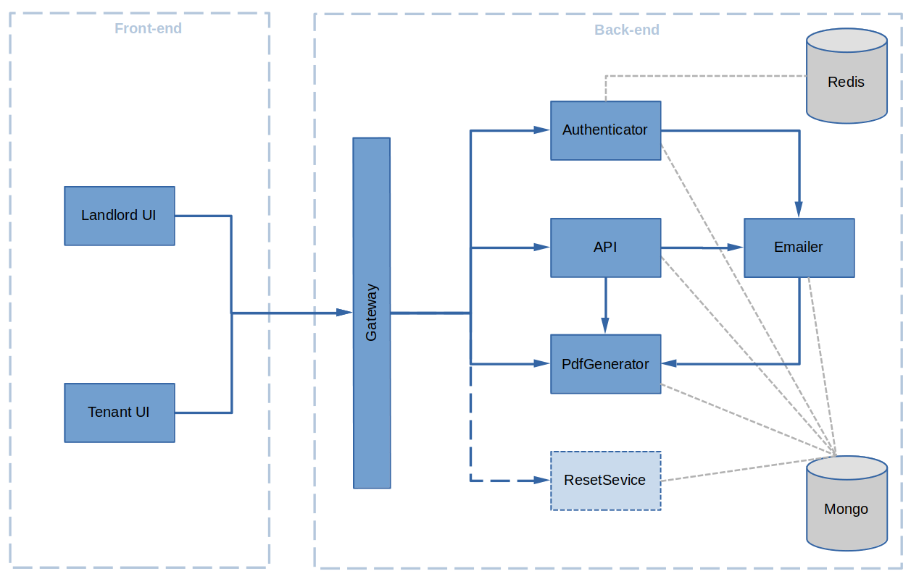
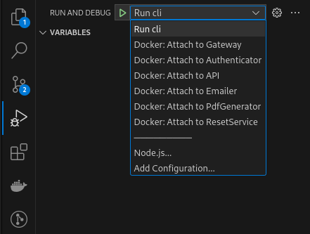

# Microrealestate

Here is a diagram showcasing the microservices on the backend and the two frontend applications:

[](./pictures/overview.png)

This diagram serves as a helpful guide to understand the overall structure and flow of the application.

| Applications and Services                  | Description                                                                    | Development Status |
| :----------------------------------------- | :----------------------------------------------------------------------------- | :----------------: |
| [Landlord UI](../webapps/landlord)         | Landlord web application                                                       |     Available      |
| [Tenant UI](../webapps/tenant)             | Tenant web application                                                         |     Available      |
| [Gateway](../services/gateway)             | Exposes UI and services, handles CORS and reverse proxies                      |     Available      |
| [Authenticator](../services/authenticator) | Handles login/logout and tokens management                                     |     Available      |
| [API](../services/api)                     | Landlord REST API                                                              |     Available      |
| [tenantApi](../services/tenantapi)         | Tenant REST API                                                                |     Available      |
| [EMailer](../services/emailer)             | Generates and sends emails with [Gmail] or [mailgun](https://www.mailgun.com/) |     Available      |
| [PDFGenerator](../services/pdfgenerator)   | Generates PDF documents (letters, contracts, invoices...)                      |     Available      |
| [ResetService](../services/resetservice)   | Uses to erase all data, only active in DEV and CI environments                 |     Available      |

## Start the application in DEV mode

### Prerequisite

- [docker and docker-compose installed](https://docs.docker.com/compose/install/)
- [node.js installed](https://nodejs.org/en/download/package-manager)
- [VS Code installed](https://code.visualstudio.com/)
- [git installed](https://git-scm.com/downloads)

### Clone the GitHub repository

```shell
git clone https://github.com/microrealestate/microrealestate.git
cd microrealestate
```

### Install de application dependencies

```shell
yarn
```

### Run the application in dev mode

```shell
yarn run dev
```

## Debug

To access the debug functionality in VS Code, navigate to the debug bar located within the IDE.



Next, attach the debugger to the service you wish to debug. This will enable you to step through the code and inspect variables, making it easier to identify and resolve any issues.

- Docker: Attach to Gateway
- Docker: Attach to Authenticator
- Docker: Attach to API
- Docker: Attach to Emailer
- Docker: Attach to PdfGenerator
- Docker: Attach to ResetService

[For more information about VS Code debugging](https://code.visualstudio.com/Docs/editor/debugging#_debug-actions)
