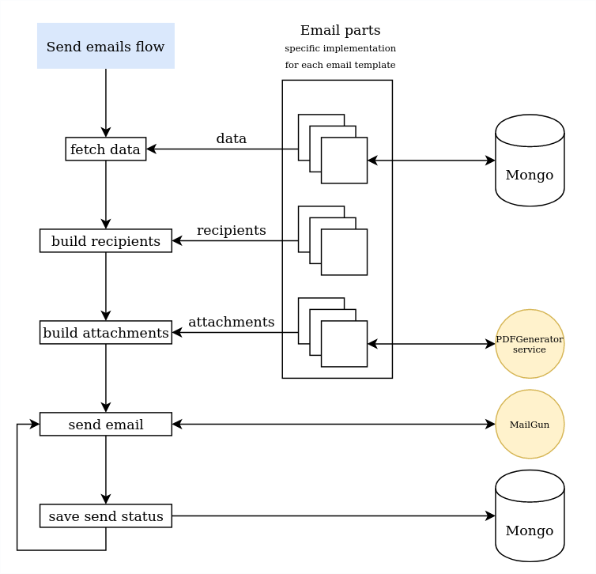

# emailer
Generates and sends emails.
This service is part of the MicroRealEstate application more [here](https://github.com/microrealestate/microrealestate/blob/master/README.md).

# API

## Send emails

Request
```
POST /emailer
headers = {
    'Application-Locale', // the application locale: en-US, fr-FR...
}
body = {
    templateName,  // email template name (invoice, rentcall, rentcall-reminder...)
    recordId,      // DB record Id or Token
    params         // extra parameters (ex. { term: 2018030100 })
}
```

Response
```
[{
    templateName,
    recordId,
    params,
    error: {      // in case of error
        status,   // http status
        message   // error message
    },
    email,        // recipient email
    status        // Mailgun status
}}
```

## Get email status

Request
```
GET /emailer/status/:startTerm/:endTerm?    // startTerm   parameters (ex. { term: 2018030100 })
                                            // endTerm     extra parameters (ex. { term: 2018030100 })
headers = {
    'Application-Locale', // the application locale: en-US, fr-FR...
}
```

Response
```
[{
    templateName,
    recordId,
    params,
    sentTo,        // recipient email
    sentDate       // sent date
}]
```

# Concept


